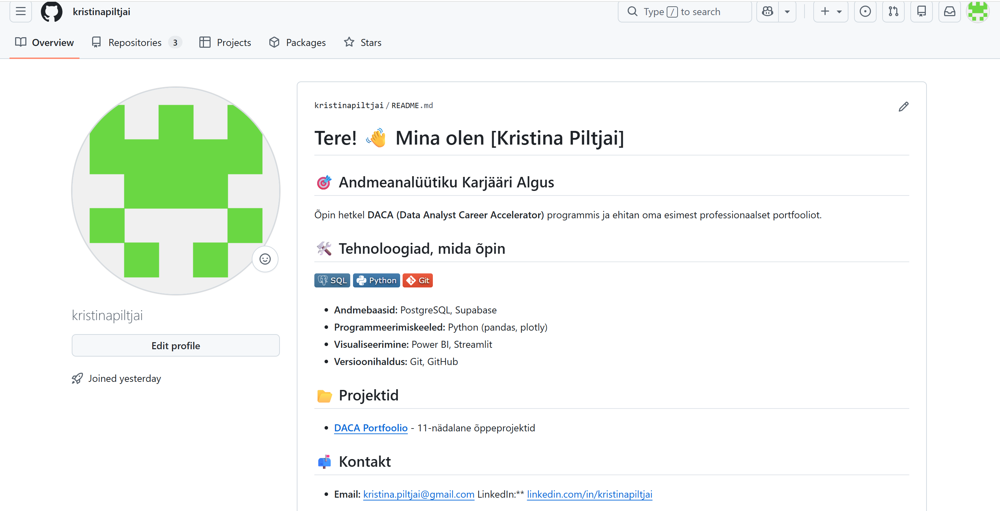

"# Week 0 GitHub Harjutus" 
# DACA Nädala 0: GitHubi ja Töökeskkonna Harjutus

**Nimi:** Kristina Piltjai  
**Kuupäev:** September 2026  
**Repositoorium:** daca-portfolio  
**Projekt:** DACA Onboarding & UrbanStyle.ltd  

---

## 1. Tööriistade ja Keskkonna Seadistus
- [x] **GitHub:** Konto loodud ja repositoorium `daca-portfolio` on avalik (Public).
- [x] **Supabase:** Konto seadistatud ja projekt `urbanstyle-datadriven` loodud (Frankfurt `eu-central-1`).
- [x] **VS Code:** Paigaldatud, Gitiga ühendatud ja seadistatud.
- [x] **NotebookLM:** Märkmik loodud ning 4 CORE RAG faili üles laetud.

---

## 2. Tiimi Rollid ja UrbanStyle Osakond
- **Meie tiim:** Sales Analytics
- **Minu roll seadistusel:** GitHub repositooriumi ja VS Code keskkonna ühendamine.
- **Esimene meeskonna kokkulepe:** Iga liige teeb oma nädala ülesanded eraldi kausta `week-X/individual/`.

---

## 3. Esimene SQL Testpäring Supabase'is
Käivitatud Supabase SQL Editoris:
```sql
SELECT 'Tere, UrbanStyle!' AS tervitus, NOW() AS aeg;
Tulemus: Päring tagastas edukalt 1 rea koos tervituse ja praeguse ajatempliga.
4. Minu Eesmärk DACA Programmis
Omandada 11 nädala jooksul praktiline andmeanalüütiku oskustepagas (SQL, Python, pandas, Power BI).
Ehitada avalik GitHub portfoolio 8–10 praktilise projektiga.

# Nädal 0 - GitHubi harjutus

## Isiklik keskkond



## Meeskonnatöö

Meeskonna repo:
https://github.com/kristinapiltjai/urbanstyle-Sales-Analytics

Meeskonna kokkulepe:
https://github.com/kristinapiltjai/urbanstyle-Sales-Analytics/blob/main/charter.md
